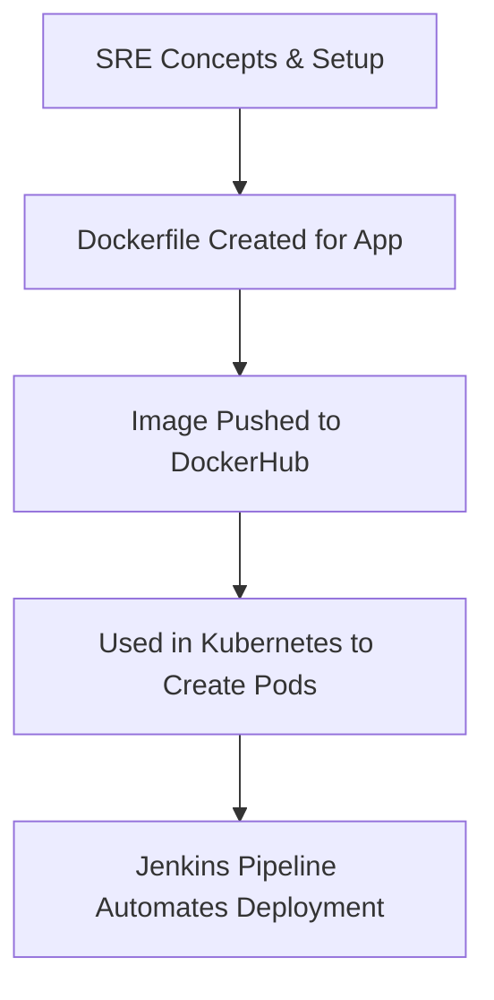

# 🚀 SRE Concepts & Workflow – BankingSystem

---

## 🧰 What We Have Done (SRE Process Overview)



## 🧰 What We Have Done (SRE Process Overview)

1. **Dockerfile Creation**  
   - Built a custom Dockerfile that bundles both Django and React applications.

2. **DockerHub Integration**  
   - Built the Docker image locally and pushed it to DockerHub for version control and sharing.

3. **Kubernetes Deployment**  
   - The image from DockerHub is used to create and update pods in the Kubernetes cluster.

4. **Jenkins CI/CD Pipeline**  
   - A Jenkins pipeline automates:
     - Docker image build
     - DockerHub push
     - Kubernetes deployment rollout
---

## 🐳 Dockerfile – Explained Step by Step

```Dockerfile
# Start with a slimmed-down version of Python 3.10 for faster builds and smaller image size
FROM python:3.10-slim

# Set the working directory in the container
WORKDIR /app
# All operations from here happen inside /app directory in the container

# Copy requirements file first to leverage Docker caching
COPY requirements.txt .
# Docker can cache layers, so copying dependencies early avoids reinstalling on every build

# Install Python dependencies
RUN pip install --no-cache-dir -r requirements.txt
# Installs all required Python packages without storing cache to reduce image size

# Copy the rest of the application code
COPY . /app/
# Copies the full backend and frontend code into the container

# Install Node.js and npm for React app
RUN apt-get update && apt-get install -y nodejs npm
# Required to run and build the React frontend (located in my-app/)

# Set working directory to React frontend
WORKDIR /app/my-app
# Change directory into the frontend folder for npm commands

# Install React and required packages
RUN npm install
RUN npm install bootstrap
RUN npm install react-scripts
RUN npm install @fortawesome/fontawesome-free
# Installs all React frontend dependencies including Bootstrap and FontAwesome icons

# Expose required ports for Django, Prometheus, and React
EXPOSE 8000 9090 3000
# 8000 → Django backend
# 3000 → React frontend
# 9090 → Prometheus monitoring

# Create Prometheus config directory
RUN mkdir -p /etc/prometheus
COPY prometheus/prometheus-config.yaml /etc/prometheus/prometheus.yml
# Ensures Prometheus config is bundled inside the image for metrics monitoring

# Reset working directory to Django backend
WORKDIR /app

# Start both React and Django using shell
CMD ["sh", "-c", "cd my-app && npm start & python manage.py runserver 0.0.0.0:8000"]
# Starts both servers:
# React on port 3000
# Django on port 8000
# The & allows React to run in background while Django continues execution
```

---

## ✅ Summary of Dockerfile

- 🐍 Uses lightweight Python base image  
- 🧠 Prevents caching and buffering in Python  
- 📦 Copies code and installs all dependencies  
- 📁 Prepares static files and sets up Node/npm for frontend  
- 🚀 Starts Django + React servers simultaneously  
- 🔍 Includes Prometheus config for monitoring support  

---
