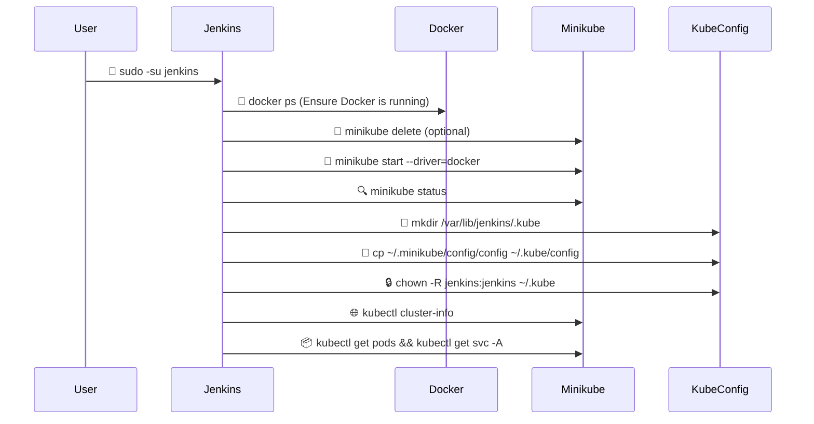
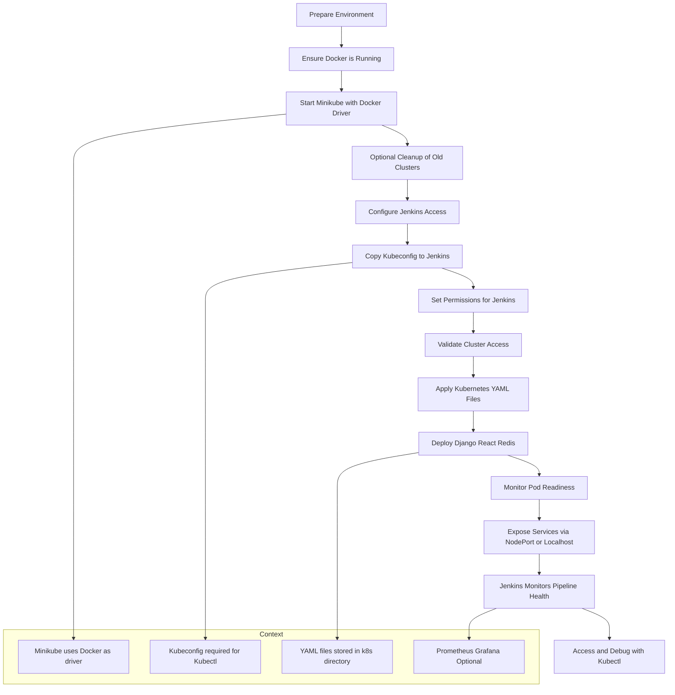

# Jenkins Pipeline Analysis 🚀

Here’s a detailed breakdown of each stage in the `Jenkinsfile` for your Banking System deployment! 🌟
---

# Jenkins Pipeline Stages Table 🚀

Here’s a quick overview of each stage in your `Jenkinsfile` and what it does in one line! 🌟

| **Stage Name**         | **One-Line Description**                                                                 |
|-----------------------|-----------------------------------------------------------------------------------------|
| `Clone Repository` 🌿  | Clones the `final` branch from GitHub to get the latest source code. 📥                |
| `Setup Minikube` 🛠️   | Sets up a Minikube cluster with Docker driver for local Kubernetes deployment. 🚀      |
| `Deploy Application` 📦| Deploys Django, React, Redis, and Celery components to the Minikube cluster. 🌐        |
| `Deploy Monitoring` 📈 | Installs Prometheus and Grafana in the `monitoring` namespace for metrics tracking. 📊 |
| `Expose Services` 🌐   | Exposes app and monitoring services via Minikube URLs and local port-forwarding. 📡    |
| `Keep Alive` ⏰        | Continuously monitors Pod statuses every 5 minutes, keeping the pipeline running. 🔄   |

---

This table summarizes the pipeline’s flow at a glance! 🌟 Let me know if you need more details! 😊✨

## Stages Explanation 📜

### 1. Clone Repository 🌿
- **Purpose**: Fetches the source code from GitHub.
- **Key Points**:
  - Clones the `final` branch from your GitHub repo using stored credentials (`Git_Jenkins`). 📥
  - Ensures Jenkins has the latest code to build and deploy. ✅
  - Sets the foundation for all subsequent stages. 🏗️
- **Code Snippet**:
  ```groovy
  stage('Clone Repository') {
      steps {
          git branch: 'final',
              credentialsId: 'Git_Jenkins',
              url: 'https://github.com/sunny567s35/BankingSystem.git'
      }
  }
  ```
---
### 2. Setup Minikube 🛠️
- **Purpose**: Prepares a local Minikube cluster for Kubernetes deployment.
- **Key Points**:
  - Creates necessary directories (`/var/lib/jenkins/.minikube`, `/var/lib/jenkins/.kube`) with proper permissions for Jenkins. 📂
  - Starts Minikube with the Docker driver if it’s not running. 🚀
  - Verifies Minikube status and switches kubectl context to Minikube. 🔄
  - Copies the Minikube config to ensure Jenkins can interact with the cluster. 🔐
```groovy
stage('Setup Minikube') {
    steps {
        script {
            sh '''
                echo "[INFO] Setting up Minikube environment..."
                sudo mkdir -p /var/lib/jenkins/.minikube
                sudo mkdir -p /var/lib/jenkins/.kube
                sudo chown -R jenkins:jenkins /var/lib/jenkins/.minikube
                sudo chown -R jenkins:jenkins /var/lib/jenkins/.kube
                if ! minikube status; then
                    minikube start --driver=docker
                    minikube update-context
                fi
                minikube status
                kubectl config use-context minikube
                kubectl cluster-info
                if [ ! -f "/var/lib/jenkins/.kube/config" ]; then
                    cp ${MINIKUBE_HOME}/profiles/minikube/client.config /var/lib/jenkins/.kube/config
                    chmod 600 /var/lib/jenkins/.kube/config
                fi
            '''
        }
    }
}
```
---
### 3. Deploy Application 📦
- **Purpose**: Deploys the core application components to Kubernetes.
- **Key Points**:
  - Finds the `k8s/` directory and applies YAML files for Django, React, Redis, and Celery components. 📋
  - Deploys Django backend, React frontend, Redis, Celery Beat, and Celery Worker. 🌐
  - Waits up to 300 seconds for Pods (Django, React, Celery) to be ready, ensuring deployment success. ⏳
  - Sets up the banking app’s functionality in the cluster. 💻
 
```groovy
stage('Deploy Application') {
    steps {
        sh '''
            echo "[INFO] Deploying application components..."
            K8S_DIR=$(find . -name k8s -type d | head -1)
            cd "${K8S_DIR}"
            kubectl apply -f deployment.yaml
            kubectl apply -f django-service.yaml
            kubectl apply -f redis-deployment.yaml
            kubectl apply -f react-deployment.yaml
            kubectl apply -f react-service.yaml
            kubectl apply -f celery-beat.yaml
            kubectl apply -f celery-worker.yaml
            echo "[INFO] Waiting for pods to be ready..."
            kubectl wait --for=condition=Ready pod -l app=django-app --timeout=300s
            kubectl wait --for=condition=Ready pod -l app=react-app --timeout=300s
            kubectl wait --for=condition=Ready pod -l app=celery-worker --timeout=300s
            kubectl wait --for=condition=Ready pod -l app=celery-beat --timeout=300s
        '''
    }
}
```
---
### 4. Deploy Monitoring 📈
- **Purpose**: Sets up Prometheus and Grafana for monitoring.
- **Key Points**:
  - Creates the `monitoring` namespace if it doesn’t exist. 📦
  - Applies Redis Exporter, Prometheus, and Grafana YAMLs from specified directories. 📊
  - Waits up to 300 seconds for Prometheus and Redis Exporter Pods to be ready. ⏳
  - Uses a custom loop (up to 5 minutes) to check Grafana’s status, with detailed debugging if it fails. 🔍
  - Confirms all monitoring components are running and logs their status. ✅
```groovy
stage('Deploy Monitoring') {
    steps {
        sh '''
            echo "[INFO] Deploying monitoring stack..."
            kubectl create namespace monitoring || true
            BASE_DIR="/home/mthree/Final/BankingSystem/BankingSystem"
            kubectl apply -f "${BASE_DIR}/k8s/redis-exporter.yaml" -n monitoring
            kubectl apply -f "${BASE_DIR}/prometheus/prometheus-config.yaml" -n monitoring
            kubectl apply -f "${BASE_DIR}/prometheus/prometheus-deployment.yaml" -n monitoring
            kubectl apply -f "${BASE_DIR}/prometheus/prometheus-service.yaml" -n monitoring
            echo "[INFO] Deploying Grafana..."
            kubectl apply -f "${BASE_DIR}/grafana/grafana.yaml" -n monitoring
            echo "[INFO] Waiting for monitoring pods..."
            kubectl wait --for=condition=Ready pod -n monitoring -l app=prometheus --timeout=300s
            kubectl wait --for=condition=Ready pod -n monitoring -l app=redis-exporter --timeout=300s
            echo "[INFO] Waiting for Grafana to be ready..."
            COUNTER=0
            while [[ $COUNTER -lt 60 ]]; do
                STATUS=$(kubectl get pods -n monitoring -l app=grafana -o jsonpath="{.items[0].status.phase}")
                if [[ "$STATUS" == "Running" ]]; then
                    echo "Grafana is running"
                    break
                fi
                echo "Waiting for Grafana... ($COUNTER/60)"
                kubectl describe pod -n monitoring -l app=grafana | grep -A 10 Events || true
                sleep 5
                COUNTER=$((COUNTER + 1))
            done
            if [[ "$STATUS" != "Running" ]]; then
                echo "[WARNING] Grafana did not reach Running state within 5 minutes"
                echo "[DEBUG] Grafana pod details:"
                kubectl describe pod -n monitoring -l app=grafana
                echo "[DEBUG] Cluster events:"
                kubectl get events -n monitoring --sort-by=.metadata.creationTimestamp
                echo "[DEBUG] PVC status:"
                kubectl get pvc -n monitoring
            else
                echo "[INFO] All monitoring components are ready"
            fi
            echo "[INFO] Monitoring components status:"
            kubectl get all -n monitoring
        '''
    }
}
```
---
### 5. Expose Services 🌐
- **Purpose**: Makes services accessible locally and externally.
- **Key Points**:
  - Retrieves Minikube IP and service URLs for Django, React, Prometheus, Grafana, and Redis Exporter. 📡
  - Displays external URLs using Minikube IP and NodePort values. 🔗
  - Starts background port-forwarding for local access (e.g., Django on 8000, Grafana on 3001). 🚪
  - Provides both Minikube URLs and local port-forwarded URLs for convenience. 👀
```groovy
stage('Expose Services') {
    steps {
        script {
            def MINIKUBE_IP = sh(script: 'minikube ip', returnStdout: true).trim()
            def DJANGO_URL = sh(script: 'minikube service django-service --url', returnStdout: true).trim()
            def REACT_URL = sh(script: 'minikube service react-service --url', returnStdout: true).trim()
            def PROMETHEUS_PORT = sh(script: 'kubectl get svc -n monitoring prometheus -o jsonpath="{.spec.ports[0].nodePort}"', returnStdout: true).trim()
            def GRAFANA_PORT = sh(script: 'kubectl get svc -n monitoring grafana -o jsonpath="{.spec.ports[0].nodePort}"', returnStdout: true).trim()
            def REDIS_EXPORTER_PORT = sh(script: 'kubectl get svc -n monitoring redis-exporter -o jsonpath="{.spec.ports[0].nodePort}"', returnStdout: true).trim()
            echo """
            =============================================
            Services are available at:
            Application Services:
            Django:       ${DJANGO_URL}
            React:        ${REACT_URL}
            Monitoring Services:
            Prometheus:   http://${MINIKUBE_IP}:${PROMETHEUS_PORT}
            Grafana:      http://${MINIKUBE_IP}:${GRAFANA_PORT}
            Redis Metrics: http://${MINIKUBE_IP}:${REDIS_EXPORTER_PORT}
            =============================================
            """
            sh '''
                pkill -f "kubectl port-forward" || true
                nohup kubectl port-forward svc/django-service 8000:8000 > django-pf.log 2>&1 &
                nohup kubectl port-forward svc/react-service 3000:3000 > react-pf.log 2>&1 &
                nohup kubectl port-forward -n monitoring svc/prometheus 9090:9090 > prometheus-pf.log 2>&1 &
                nohup kubectl port-forward -n monitoring svc/grafana 3001:3000 > grafana-pf.log 2>&1 &
                nohup kubectl port-forward -n monitoring svc/redis-exporter 9121:9121 > redis-exporter-pf.log 2>&1 &
                echo "Local access ports:"
                echo "Django:        http://localhost:8000"
                echo "React:         http://localhost:3000"
                echo "Prometheus:    http://localhost:9090"
                echo "Grafana:       http://localhost:3001"
                echo "Redis Metrics: http://localhost:9121"
            '''
        }
    }
}
```
---
### 6. Keep Alive ⏰
- **Purpose**: Monitors the deployment continuously.
- **Key Points**:
  - Runs an infinite loop to check the status of all Pods every 5 minutes. 🔄
  - Monitors Django, React, Celery Worker, Prometheus, Grafana, and Redis Exporter Pods. 👁️‍🗨️
  - Keeps the pipeline active to ensure services remain accessible and healthy. 🩺
  - Explains why the pipeline doesn’t stop (see below). ⏳
```groovy
stage('Keep Alive') {
    steps {
        script {
            echo "All services are now running and accessible."
            sh '''
                while true; do
                    echo "[STATUS CHECK] $(date)"
                    echo "Application Pods:"
                    echo "Django: $(kubectl get pod -l app=django-app -o jsonpath='{.items[0].status.phase}')"
                    echo "React: $(kubectl get pod -l app=react-app -o jsonpath='{.items[0].status.phase}')"
                    echo "Celery: $(kubectl get pod -l app=celery-worker -o jsonpath='{.items[0].status.phase}')"
                    echo "Monitoring Pods:"
                    echo "Prometheus: $(kubectl get pod -n monitoring -l app=prometheus -o jsonpath='{.items[0].status.phase}')"
                    echo "Grafana: $(kubectl get pod -n monitoring -l app=grafana -o jsonpath='{.items[0].status.phase}')"
                    echo "Redis Exporter: $(kubectl get pod -n monitoring -l app=redis-exporter -o jsonpath='{.items[0].status.phase}')"
                    sleep 300
                done
            '''
        }
    }
}
```
---
## Why the Pipeline Doesn’t Stop Running ❓
- The `Keep Alive` stage includes an infinite `while true` loop that checks Pod statuses every 300 seconds. 🔄
- This loop prevents the pipeline from completing naturally, as Jenkins waits for it to finish. ⏳
- It’s designed to keep services running and monitored during the Jenkins job, useful for testing or demos. 🖥️
- To stop it, you must manually abort the Jenkins job, which triggers the `post` cleanup to kill port-forwarding processes. 🛑

## Commands Used 🛠️
- From your list, here are the key commands relevant to this setup (unnecessary ones like `ngrok` setup omitted):
  - `minikube start --driver=docker`: Starts Minikube with Docker driver. 🚀
  - `minikube status`: Checks Minikube cluster status. 🔍
  - `docker ps`: Lists running Docker containers (e.g., Minikube). 🐳
  - `kubectl get pods`: Checks Pod statuses in the default namespace. 📦
  - `kubectl get pods -n monitoring`: Checks monitoring Pods. 📊
  - `kubectl get svc`: Lists services for access details. 🌐
  - `minikube service django-service --url`: Gets Django service URL. 🔗
  - `minikube service react-service --url`: Gets React service URL. 🔗
  - `sudo mkdir -p /var/lib/jenkins/.kube`: Creates kube config directory. 📂
  - `sudo cp /var/lib/jenkins/.minikube/config/config /var/lib/jenkins/.kube/config`: Sets up kubeconfig for Jenkins. 🔐
  - `sudo chown -R jenkins:jenkins /var/lib/jenkins/.kube`: Ensures Jenkins owns the config. 🔒

---

# Minikube Setup in Jenkins Analysis 🚀

Here’s an analysis of your commands to start Minikube in Jenkins, with the appropriate and required steps added! 🌟

## Commands Analyzed 📜
You’ve run many commands to troubleshoot Minikube in Jenkins. Below are the key ones relevant to starting Minikube, with explanations:

- **sudo -su jenkins**: Switches to the Jenkins user to run commands as Jenkins. 🔐
- **minikube start**: Attempts to start Minikube (repeated multiple times). 🚀
- **minikube status**: Checks if Minikube is running (used frequently for debugging). 🔍
- **docker ps**: Lists Docker containers, likely to verify Minikube’s Docker driver. 🐳
- **minikube start --driver=docker**: Starts Minikube explicitly with the Docker driver. 🚀
- **sudo mkdir -p /var/lib/jenkins/.kube**: Creates the Kubernetes config directory for Jenkins. 📂
- **sudo cp /var/lib/jenkins/.minikube/config/config /var/lib/jenkins/.kube/config**: Copies Minikube’s config to Jenkins’ kubeconfig. 🔐
- **sudo chown -R jenkins:jenkins /var/lib/jenkins/.kube**: Ensures Jenkins owns the config directory. 🔒
- **kubectl get pods**: Checks running Pods after Minikube starts. 📦
- **kubectl get svc**: Lists services to verify networking setup. 🌐

## 🛠️ Minikube Setup Flow in Jenkins (Mermaid Diagram)



## Why These Steps?
- Your setup as root user (`sudo -su jenkins`) and repeated `minikube start` attempts suggest permission or config issues. These steps ensure proper permissions and a clean Minikube start. ✅
- Using `--driver=docker` aligns with your successful command and Jenkins’ typical environment. 🐳
- The config steps (`mkdir`, `cp`, `chown`) match your commands and the `Jenkinsfile` requirements. 🔐

---


