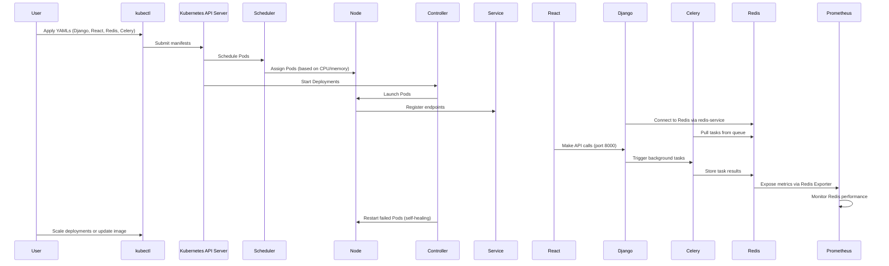

# 🏦 Banking System on Kubernetes 🚀

---

## 📄 YAML File Analysis

### `celery-beat.yaml`
**Purpose**: Deploys a **Celery Beat scheduler** for periodic task management.  
**Key Points**:
- Runs a single replica using the `vishnuvardhandommeti/bank:v2` image.
- Executes the Celery Beat command.
- Uses Redis (`redis-service`) as the broker and result backend.
- Environment variables configure Redis connection.

---

### `celery-worker.yaml`
**Purpose**: Deploys a **Celery Worker** to process background tasks.  
**Key Points**:
- Uses the same `bank:v2` image.
- Runs the Celery Worker command.
- Connects to Redis for tasks and results.

---

### `deployment.yaml`
**Purpose**: Deploys the **Django backend application**.  
**Key Points**:
- Runs one Pod using `bank:v2`, labeled as `django-app`.
- Exposes **ports 8000 (Django)** and **3000 (React?)** — unusual but could be a combined image.
- Ensures high availability and restart policies.

---

### `django-service.yaml`
**Purpose**: Exposes the **Django app externally** via a NodePort.  
**Key Points**:
- Targets Pods with label `django-app`.
- Maps **port 8000** to the Pod’s **8000**.
- Accessible externally via node IP and assigned port.

---

### `react-deployment.yaml`
**Purpose**: Deploys the **React frontend** separately.  
**Key Points**:
- Uses `bank:v2` image, labeled as `react-app`.
- Exposes **port 3000**.

---

### `react-service.yaml`
**Purpose**: Exposes the **React app externally** via NodePort.  
**Key Points**:
- Maps **port 3000** to Pod port **3000**.
- Allows users to access the frontend UI.

---

### `redis-deployment.yaml`
**Purpose**: Deploys a **Redis instance** for Celery and Django.  
**Key Points**:
- Uses `redis:alpine` image.
- Exposes port **6379**.
- Includes resource limits (256Mi memory, 500m CPU).
- Internal access via `redis-service`.

---

### `redis-exporter.yaml`
**Purpose**: Deploys a **Redis Exporter** for monitoring Redis metrics.  
**Key Points**:
- Runs in the `monitoring` namespace.
- Uses `bitnami/redis-exporter` image.
- Exposes **port 9121**.
- Can be scraped by Prometheus.

---

## 📊 Quick Table: One-Line Summary for Each YAML File

| File Name             | One-Line Explanation                                                                 |
|-----------------------|---------------------------------------------------------------------------------------|
| `celery-beat.yaml`    | Deploys a Celery Beat scheduler to manage periodic tasks using Redis as the backend. |
| `celery-worker.yaml`  | Deploys a Celery Worker to process background tasks queued via Redis.                |
| `deployment.yaml`     | Deploys a Django backend (possibly with React) on ports 8000 and 3000.               |
| `django-service.yaml` | Exposes the Django app externally via a NodePort Service on port 8000.              |
| `react-deployment.yaml` | Deploys a React frontend application on port 3000.                                  |
| `react-service.yaml`  | Exposes the React app externally via a NodePort Service on port 3000.               |
| `redis-deployment.yaml` | Deploys a Redis instance and ClusterIP Service for task queuing and caching.        |
| `redis-exporter.yaml` | Deploys a Redis Exporter in the monitoring namespace for Redis metrics.              |

---

# Kubernetes Workflow Explanation ⚙️

Here’s how Kubernetes manages your Django-React banking system with Celery and Redis! 🚀

1. **Define Desired State** 📝
   - YAML files outline the setup: Django, React, Celery Beat, Worker, Redis, and Exporter. 📜
   - Specifies replicas, images, ports, and configs (e.g., Redis URLs for Celery). 🌍

2. **Apply Resources** 🚀
   - Submit YAMLs to the Kubernetes API server with `kubectl apply`. ✅
   - The server stores these and starts creating resources. 🛠️

3. **Pod Scheduling** 🗺️
   - Scheduler places Pods (e.g., `django-app`, `redis`) on nodes based on resources. 📍
   - Redis, for example, fits nodes with 256Mi memory and 500m CPU. ⚖️

4. **Controller Management** 🕹️
   - Deployment controllers keep replicas (all 1 here) running. 🔄
   - Restarts failed Pods like `celery-worker` to match the desired state. 🛡️

5. **Service Networking** 🌐
   - Services (`django-service`, `redis-service`) provide stable endpoints. 📡
   - `django-service` exposes Django externally on 8000; `redis-service` links internally on 6379. 🔗
   - Celery connects to Redis via `redis-service:6379`. 🛤️

6. **Task Processing** ⏳
   - Celery Beat schedules tasks and queues them in Redis. 📅
   - Celery Worker processes tasks from Redis and stores results. ⚙️
   - Django triggers tasks (e.g., via APIs) for background handling. 📦

7. **Frontend-Backend Interaction** 💻
   - React (`react-service`) serves the frontend on 3000, externally accessible. 👀
   - Talks to Django (`django-service`) on 8000 for API calls. 📞
   - Note: `deployment.yaml` has both 8000 and 3000—check if React is separate! 🤔

8. **Monitoring** 📈
   - Redis Exporter gathers metrics from Redis on port 9121. 👁️‍🗨️
   - Pairs with Prometheus to track Redis health and performance. 📊

9. **Self-Healing** 🩺
   - Failed Pods (e.g., Redis) are restarted by Deployments. 🔄
   - Services ensure continuity despite Pod rescheduling. 🛡️

10. **Scaling and Updates** 📏
    - Scale by increasing replicas (e.g., in `celery-worker.yaml`). 📈
    - Update images (e.g., `bank:v3`) and reapply for rolling updates. 🔄

