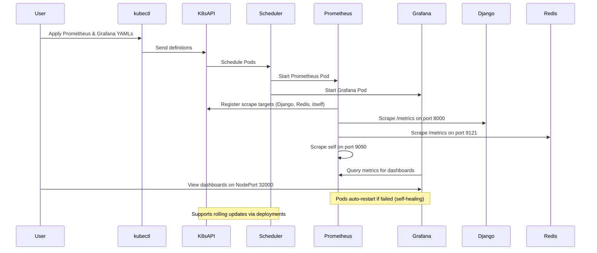

# Kubernetes Monitoring YAML Files Analysis 🌟

Here’s an analysis of the monitoring-related Kubernetes YAML files, along with a summary table! 🚀

## Analysis of Each YAML File 📜

### 1. `prometheus-config.yaml` ⚙️
- **Purpose**: Defines the configuration for Prometheus to scrape metrics.
- **Key Points**:
  - Creates a ConfigMap in the `monitoring` namespace. 🗂️
  - Sets a 15-second scrape interval for metrics collection. ⏱️
  - Configures jobs to scrape Django app metrics from port 8000. 📈
  - Monitors Prometheus itself on localhost:9090. 🔄
  - Scrapes Redis metrics from the exporter on port 9121. 🗄️

### 2. `prometheus-deployment.yaml` 📊
- **Purpose**: Deploys the Prometheus server to collect and store metrics.
- **Key Points**:
  - Runs a single replica in the `monitoring` namespace with `prom/prometheus` image. 🖼️
  - Exposes port 9090 for accessing the Prometheus UI and API. 🚪
  - Mounts the `prometheus-config` ConfigMap as a volume for configuration. 📝
  - Ensures Prometheus is always running and recoverable. 🔄

### 3. `prometheus-service.yaml` 🌐
- **Purpose**: Exposes Prometheus externally for access.
- **Key Points**:
  - Creates a NodePort Service in the `monitoring` namespace. 📡
  - Maps port 9090 to node port 30090 for external access. 🚪
  - Targets Pods labeled `app: prometheus`. 🏷️
  - Allows users to view metrics via a node’s IP and port 30090. 👀

### 4. `grafana.yaml` 🎨
- **Purpose**: Deploys Grafana for visualizing metrics with persistent storage.
- **Key Points**:
  - Requests a 1Gi PersistentVolumeClaim for Grafana data in `monitoring`. 💾
  - Runs a single Pod with `grafana/grafana:latest`, exposing port 3000. 🖼️
  - Mounts persistent storage to save dashboards and settings. 📂
  - Includes a NodePort Service on port 32000 for external access. 📡

## Summary Table 📋

| **File Name**             | **One-Line Explanation**                                                                 |
|--------------------------|-----------------------------------------------------------------------------------------|
| `prometheus-config.yaml`  | Configures Prometheus to scrape metrics from Django, Redis, and itself every 15s. ⚙️    |
| `prometheus-deployment.yaml`| Deploys a Prometheus server to collect metrics on port 9090. 📊                        |
| `prometheus-service.yaml` | Exposes Prometheus externally via NodePort on 30090. 🌐                                 |
| `grafana.yaml`            | Deploys Grafana with persistent storage and exposes it on NodePort 32000. 🎨           |

---

# Kubernetes Workflow Explanation for Monitoring ⚙️

Here’s how Kubernetes manages the monitoring stack with Prometheus and Grafana! 🚀

1. **Define Desired State** 📝
   - YAML files specify Prometheus and Grafana setups in the `monitoring` namespace. 📜
   - Includes configs, deployments, services, and storage for metrics and visualization. 🌍

2. **Apply Resources** 🚀
   - Use `kubectl apply` to send YAMLs to the Kubernetes API server. ✅
   - The server stores these definitions and starts creating resources. 🛠️

3. **Pod Scheduling** 🗺️
   - Scheduler assigns Pods (e.g., `prometheus`, `grafana`) to nodes based on resources. 📍
   - Ensures availability for metrics collection and visualization. ⚖️

4. **Controller Management** 🕹️
   - Deployment controllers keep one replica running for Prometheus and Grafana. 🔄
   - Restarts any failed Pods to maintain the desired state. 🛡️

5. **Service Networking** 🌐
   - NodePort Services expose Prometheus on 30090 and Grafana on 32000 externally. 📡
   - Internal configs link Prometheus to scrape targets like Django and Redis. 🔗
   - Stable endpoints ensure consistent access to monitoring tools. 🛤️

6. **Metrics Collection** 📈
   - Prometheus scrapes metrics every 15 seconds from Django (8000), Redis (9121), and itself (9090). ⏱️
   - Stores data for querying and analysis. 🗃️
   - ConfigMap provides the scraping rules and targets. 📝

7. **Visualization** 🎨
   - Grafana connects to Prometheus to display metrics via dashboards. 👀
   - Accessible externally on port 32000 for users to view. 📊
   - Persistent storage keeps dashboards and settings across restarts. 💾

8. **Self-Healing** 🩺
   - If Prometheus or Grafana Pods fail, Deployments restart them. 🔄
   - Services maintain access even if Pods move to new nodes. 🛡️

9. **Scaling and Updates** 📏
   - Scale by increasing replicas in deployment files if needed (e.g., for Grafana). 📈
   - Update images (e.g., new Prometheus version) and reapply for rolling updates. 🔄
  
---

